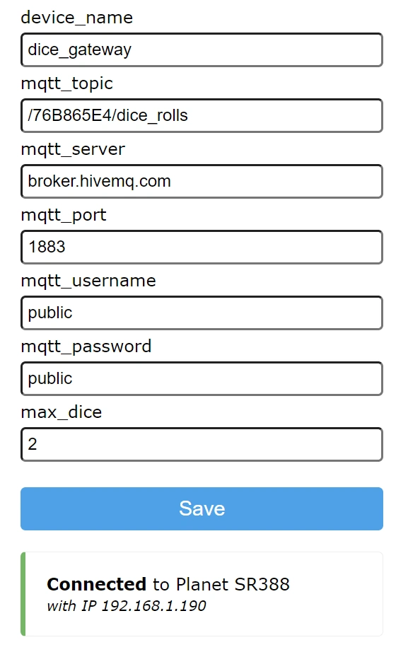

# Pixel Dice ESP32 Gateway

A ESP32 project to provide an interface for [Pixel Dice]( https://github.com/GameWithPixels) to a WiFi network or other embedded applications.

The motivation for this, is to allow an ESP32 to stay connected to the dice to connect them to other software or to trigger effects. This avoids issues with phones going to sleep, or needing a dedicated PC to connect to the dice.

Currently this just supports publishing the dice rolls to an MQTT server.

This project is basically a mash-up of the following libraries:
 - <https://github.com/tzapu/WiFiManager> - WiFi configuration management and web portal
 - <https://github.com/axlan/arduino-pixels-dice> - Pixels dice BLE interface
 - <https://github.com/256dpi/arduino-mqtt> - MQTT client

# Installation

This repository contains project files for the build tool PlatformIO. The easiest way to use it is as a VSCode extension. See <https://docs.platformio.org/en/stable/integration/ide/vscode.html> for a getting started guide.

Once the PlatformIO project is open:

This will try to autodetect the ESP32 serial port, but if you have multiple serial devices, you may need to set the [upload_port](https://docs.platformio.org/en/latest/projectconf/sections/env/options/upload/upload_port.html) setting in the `platformio.ini` file.

# Setup

Once the ESP32 is running the firmware you'll need to setup the WiFi and MQTT settings.

If the ESP32 can't connect to an existing WiFi network, it will make it's own access point with the SSID: "DiceGatewayAP".

Connecting to this will bring up a dialogue on your phone our computer to "sign in to network" where you'll have access to the configuration web page.

This will let you set the WiFi credentials or go to the setup menu to modify the MQTT settings.

Once the ESP32 is configured to connect to a network, these menus can still be accessed by going to the devices IP address in a web browser.

The IP address is printed over serial (115200 baud). Otherwise, you'll need to find the device by going to your router and looking for new connections.

# Usage

The device will scan for and connect to any Pixel Dice until the value in the `max_dice` setting is reached.

It will report all the roll events to the MQTT server if it can connect to it.

## Understanding MQTT

[MQTT](https://mqtt.org/) is a protocol optimized for IoT devices. Rather then directly connecting devices, the clients connect through a "broker".

For example, I can configure my "Pixel Dice ESP32 Gateway" client to connect to a broker running on my LAN. I can then connect the Python client code `python\dice_logger.py` to the same server.

The "Pixel Dice ESP32 Gateway" client publishes to a "channel", and if the Python client listens to the same channel, it will get the data as it's published.

## MQTT brokers

[Eclipse Mosquitto](https://mosquitto.org/) is a popular open source broker that you can run locally.

There are many cloud based MQTT broker options as well. The default settings use the [free HiveMQ broker](https://www.hivemq.com/mqtt/public-mqtt-broker/). I have no reason to suggest them over other options, but I wanted to make the default an option that required minimum setup.

To avoid making the default settings conflict, the default channel your device publishes to will be a function of the device's unique identifier.

# Updating

To update a device already running the firmware you have three options:

1. Use the installation method to reflash the device over serial.
2. Set the `upload_port` option in the `platformio.ini` file, to the devices IP address. With this set, the PlatformIO upload command will try to perform an OTA update on the device.
3. Go to the URL http://your_device_ip/update? , and upload the binary file. This can be found in the release files on this repo, or in `.pio\build\esp32dev\firmware.bin`.

# TODO
 - Add other triggers like sending HTTP requests or triggering GPIO
 - Add mDNS or other LAN discovery tool
 - Add <https://esphome.github.io/esp-web-tools/> integration to make installation possible without installing tools
 - Add functionality to the Python server and make it easier to run and configure without Python experience
 - Give the ESP32 web interface a display of dice status (names, battery, etc.)
